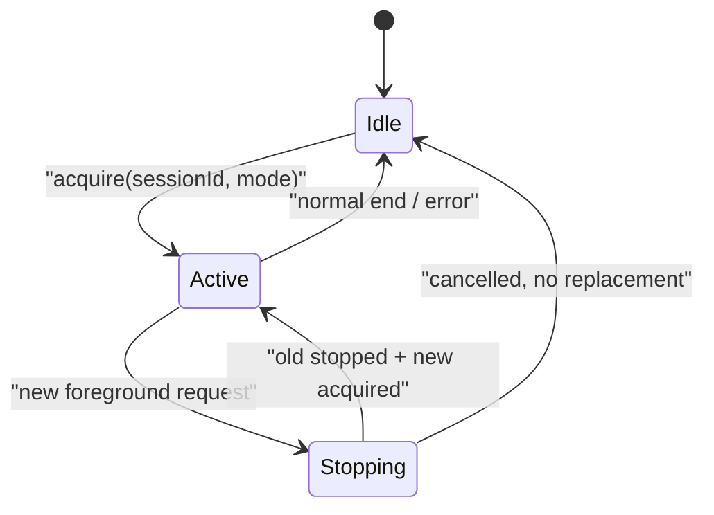
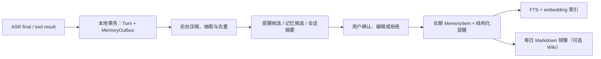

# Companion memory and arbitration preparation (2026-08-29)

状态：`PREPARATION_ONLY / NOT_FROZEN / NO_DEVICE_OPERATION`

本文记录 DeskMate Companion 的两项准备结论：语音工作流的互斥/打断，以及可恢复、可检索的长期记忆。它不创建 `F:\wiki` 目录、不写入用户记忆、不选择 embedding 供应商，也不冻结数据库、IPC、DeskMate Link 或固件合同。

## 1. 前台会话必须互斥，且新请求有确定的优先级

`dictation` 和 `companion` 是不同产品工作流，但二者争用同一组前台资源：音频采集、实时上游会话、语音播放、小智表情状态和用户注意力。规则不是“尽量避免冲突”，而是“同时只有一个前台会话所有者”。

候选仲裁规则：

1. 任何新的前台请求（听写键或陪伴聊天键）均可打断当前的另一模式；不能排队到旧会话自然结束。
2. 打断顺序固定为：停止本地播放 → 取消上游流 → 关闭麦克风/播放租约 → 等待或超时隔离旧会话 → 获取新会话资源。听写打断陪伴时，角色立即停止说话；陪伴打断听写时，未完成的听写草稿默认丢弃，已确认完成的文字不回滚。
3. 每个事件都带单调递增的 `sessionId` 和 `generation`。即使云端在取消后仍迟到发送 TTS/文字，桌面和小智适配器只接受当前 generation，旧事件必须静默丢弃。
4. 停止是可观测的：`stopping`、`cancelled`、`timeout_isolated`、`acquired` 都要有测试向量。超时不是把旧会话继续留着，而是本地撤销其播放/显示权限并断开它。
5. `emergency_stop` 高于所有模式；后续小智 Link 只接收仲裁后的高层状态，不能绕过桌面仲裁器。

这同时满足“可以相互截断”和“不能相互抢占”：前者表示新会话能立即替换旧会话，后者表示任何时刻都不允许两条音频/控制链并行拥有资源。

## 2. 记忆不是一个 Markdown 文件，而是一条可恢复的数据管线

完整上下文会变长、变慢且更容易被旧内容干扰；成熟做法会把短期会话和长期记忆分开，并把事实、经历和规则分层。[LangChain 的记忆概念说明](https://docs.langchain.com/oss/python/concepts/memory)也区分 thread-scoped 短期状态与跨会话的长期记忆，并说明后台生成记忆可避免影响实时对话延迟。

DeskMate 的候选管线如下：

`Turn + MemoryOutbox` 是断电恢复的关键：每个已完成 ASR 回合、每个已执行工具结果和每条用户确认都以唯一事件 ID 在同一个本地事务中写入；摘要器只处理尚未确认完成的 outbox 项。电脑重启时扫描未完成项并重试，因此不会因“还没到整点/还没做每日总结”丢失已完成的内容。未完成的音频、ASR partial 和流式回复不保存为长期记忆。

SQLite 的 WAL 模式适合这种单机、短事务的桌面场景：它支持持续记录事务，官方文档明确说明 `synchronous=FULL` 会在每次提交同步 WAL，而 checkpoint 负责把 WAL 内容安全回写数据库；checkpoint 的频率是性能与耐断电之间的取舍。[SQLite WAL 文档](https://sqlite.org/wal.html) 同时指出 WAL 仅适用于同一台主机，不应放在网络文件系统上。

## 3. 何时总结：不按“整点硬切”，采用事件 + 安静窗口 + 每日收口

不建议把每一小时的原对话直接交给模型做一次大摘要。它会把同一件事反复概括，且跨小时的对话很容易被切断。建议使用三层节奏：

| 时机 | 处理内容 | 是否阻塞聊天 |
| --- | --- | --- |
| 每个已完成回合 | 立即写入最小恢复事件；紧急提醒/用户明确“记住”可立刻生成候选 | 否；提醒候选可以即时展示 |
| 会话安静 2–5 分钟、结束或达到约 8–12 回合 | 合并本段会话，抽取短摘要、未完成承诺、记忆候选；按事件 ID 幂等写入 | 否，后台执行 |
| 每日固定时段或次日启动补偿 | 从本日已经确认的候选和片段摘要生成日记、项目进展、待办回顾 | 否，后台执行 |

正常关机应尝试让后台任务完成一个短的 flush；异常关机不依赖这个动作。启动恢复必须先扫描 `MemoryOutbox`，再决定是否生成遗漏摘要。这样“原始临时对话不长期保留”的偏好，与“已经完成的重要内容不能因为关机而丢”可以同时满足。

候选默认保留策略尚未冻结。方向是：ASR partial 只在内存中；已完成转写仅作短期恢复材料并设可配置过期；用户确认的提醒、偏好、项目承诺和日记摘要才进入长期库。录音默认不进入长期记忆。

## 4. 长期记忆的数据类型与用户控制

| 类型 | 示例 | 存储/调用方式 |
| --- | --- | --- |
| `profile` | 偏好、称呼、工作节奏 | 小而严格的字段；更新前展示差异 |
| `memory_item` | 用户正在推进的项目、已确认的约定 | 多条独立记录，带来源、置信度、失效时间和状态 |
| `episode` | 一段已摘要的讨论、一次工具执行结果 | 可按日期/项目/人物检索；不等于事实 |
| `reminder` | 时间、时区、重复规则、状态 | 独立任务记录，必须确认，不能只存为文本记忆 |
| `daily_summary` | 当日精炼回顾、未完成事项 | 人可读 Markdown + 可检索源记录 |

每一项必须包含：稳定 ID、schema 版本、创建/更新/失效时间、来源回合 ID、敏感级别、用户状态（候选/已确认/已拒绝/已删除）和 embedding 版本。用户应能查看“它为什么记住了这条”、编辑、删除、暂时禁用记忆和重新生成当日摘要。

## 5. 向量检索：必须与结构化筛选、全文检索一起工作

Embedding 用于“意思相近”的召回，而不是决定事实真伪或执行权限。检索顺序候选为：

1. 先取当前会话短摘要和显式的活跃提醒/项目；这些走结构化查询，不走向量。
2. 对用户问题同时做全文检索（关键词/标题）与 embedding 相似度检索；合并候选。
3. 按 `confirmed`、权限/敏感级别、记忆类型、项目、时间范围和删除状态过滤；再将相似度、关键词命中、来源质量和适度的时间衰减重排。
4. 只把少量带来源 ID 的片段交给模型；模型答复可显示“来自哪一天/哪项记忆”，避免把相似但过期的内容说成事实。

每条向量均保存 `embedding_model_id`、版本、维度、文本内容哈希和索引状态。更换模型、切分规则或向量维度后必须新建索引版本并后台重建，不能把不同模型生成的向量混在同一相似度搜索中。

`sqlite-vec` 是一个可在 Windows 上运行、能存储和查询向量的 SQLite 扩展，但其官方 README 仍明确标注为 pre-v1、可能有 breaking changes。[sqlite-vec README](https://github.com/asg017/sqlite-vec/blob/main/README.md) 因此它可以作为后续原型候选，不能在当前阶段锁定为正式依赖。若未来知识库规模和并发显著增长，可评估独立的本地 Qdrant；它的持久化设计同样依赖 WAL 和操作序号来从异常关机恢复。[Qdrant Storage 文档](https://qdrant.tech/documentation/manage-data/storage/)

V1 的安全顺序是：先完成 SQLite 的结构化记录、全文检索、事件恢复和测试；再以可替换 `EmbeddingProvider` / `VectorIndex` 接口接入本地或经用户许可的云端 embedding。任何云端 embedding 都要在设置中明确数据会离开电脑；默认不把敏感原文、录音、凭据或窗口标题送往服务商。

## 6. 现有 `F:\wiki` 的位置：归档镜像和可选检索源，不是事务主库

已只读确认 `F:\wiki` 是 Obsidian Vault，且已有 `99-会话记忆`，其中设计了小时快照、每日反思、`NOW.md` 和 `lessons/decisions/projects` 分层。这与 DeskMate 的人可读归档方向一致。

但该现有脚本会“追加每日 Markdown 后清理 pending 文件”，没有 DeskMate 所需的事务 outbox、事件 ID、幂等键、embedding 版本或搜索索引；直接让 DeskMate 复用并写入它，可能在崩溃重试时重复摘要，也会混入其他系统的会话记忆。

用户已经授权新建独立的 ASCII 根目录：`F:\wiki\deskmate-memory\`。该目录不属于、也不得触碰 `F:\wiki\99-会话记忆`。使用规则：

- DeskMate 自己的本地数据库是唯一事务主库；Wiki 文件是单向、可重建的 Markdown 镜像。
- 每日日记只导出已经摘要/确认的内容，默认不导出完整临时对话或录音。
- 每个 Markdown 文件含 `memory_id`、`schema_version`、`source_hash` 和导出时间；重复导出只更新对应文件，禁止扫写或改动其他 Wiki 内容。
- 向量索引保存在 DeskMate 的本地索引中，记录 Markdown 的来源 URI 和哈希；不要把向量塞进 Markdown，也不要让索引器把它自己的导出再次当新记忆。

## 7. 本轮未冻结的后续任务

1. 冻结 `ForegroundSessionArbiter` 的事件、超时、取消与陈旧事件拒绝测试向量。
2. 冻结本地 `MemoryStore` / `MemoryOutbox` / `ReminderStore` 的最小 schema 与隐私/删除策略。
3. 先实现 fake realtime provider 下的中断、断电恢复和确认卡测试；不接云端、不接小智。
4. 评估本地 embedding 模型、成本、资源占用和 Windows 打包方式后，再冻结 `EmbeddingProvider` 与 `VectorIndex`。
5. 在用户明确授权后，单独实现 Wiki 镜像适配器和针对 `deskmate-companion` 子目录的索引，不改现有 `99-会话记忆` 脚本。
