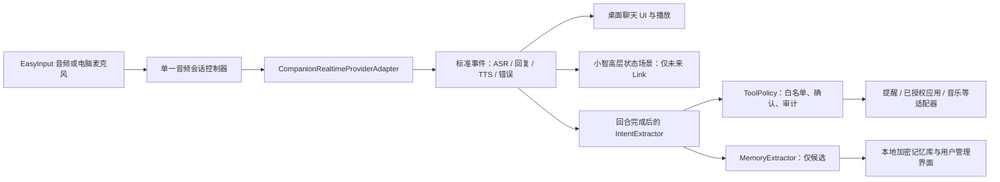

# Companion realtime bridge preparation (2026-08-29)

状态：`PREPARATION_ONLY / NOT_FROZEN / NO_DEVICE_OPERATION / NO_SOURCE_COPY`

本文档是对用户自有的外部项目 `F:\Codex\suligent` 的只读技术学习结果。它不是 DeskMate 的实现任务、接口合同或供应商选型结论；不授权读取密钥、启动其服务、复制代码、复制音频素材或连接任何硬件。

## 1. 来源与可复用边界

审阅基线：`F:\Codex\suligent`，分支 `codex/tencent-cloud-deployment`，HEAD `3e2744fcef780466e82d6803362573c6d8560cf0`（2026-08-03）。根目录未发现 `LICENSE`、`NOTICE` 或同等授权文件；因此其代码许可证当前为 `LICENSE_UNKNOWN`。

DeskMate 可以学习下列设计模式，但在许可证、文件级来源、修改说明和目标路径记录完成前，不能复制或派生任何实现：

| 模式 | 外部项目中的证据 | DeskMate 的结论 |
| --- | --- | --- |
| 实时桥接 | 浏览器 WebSocket 传输音频；本地服务连接云端实时语音并把原始上游消息归一化 | 可复用“供应商适配器 → 版本化内部事件”的边界；不复用云端二进制 framing |
| 事件状态 | ASR partial/final、chat partial/end、TTS start/end 与错误分别通知 UI | DeskMate 也应以显式事件驱动小智屏幕和桌面 UI，而不是让 UI 解析供应商消息 |
| 后台意图 | ASR final 后进入串行意图队列，产出 `business.intent`，由前端执行后回执 | 可复用“聊天不直接执行动作”的桥接思想；原项目的导览意图不能复用 |
| 会话恢复 | 以 `clientSessionId` 保留最近对话与一个待确认状态，带数量上限 | 仅适合短时重连；不是长期记忆，重启后消失，不能作为 DeskMate 记忆方案 |
| 安全边界 | 本地 WebSocket 有消息上限、来源限制、心跳与失败后重连 | 这些应进入 DeskMate 的本地 IPC/桥接测试，但不能照搬为板间 DeskMate Link |

外部项目当前角色是苏州文化导览，意图为分类浏览和页面跳转；其系统提示、角色设定、导航状态和网页 UI 都不适用于日常陪伴、提醒或 Windows 工作流。

## 2. 两个产品工作流：必须分开

用户已确认“文字输入转译”稳定，陪伴聊天必须作为独立功能，而不是把聊天塞进现有听写结果。DeskMate 仍只能维持一份版本化的底层语音会话状态机，以避免两套录音/抢占逻辑相互冲突；但上层的语义、输出、存储和权限必须完全分开。

| 工作流 | 触发和结束 | 主要输出 | 允许的后续处理 | 不应做的事 |
| --- | --- | --- | --- | --- |
| `dictation`（现有文字输入） | 现有语音键/快捷键；一次说话结束 | 整理后的可输入文字 | 历史、词库、目标窗口输出 | 不进入陪伴人格、长期记忆或工具执行 |
| `companion`（新增陪伴聊天） | 独立的聊天开关或按住说话；支持打断和多轮 | 实时文字、角色语音、聊天记录和状态场景 | 经独立意图桥接后提出工具/记忆候选 | 不把模型原话当作 Windows 命令或提醒写入 |

建议把共有能力收敛到 `AudioSessionController`、设备输入适配器、ASR/TTS 适配器和互斥/打断规则；把 `CompanionConversation`、人格、上下文、记忆与工具政策作为独立域模块。这样既保持文字输入稳定，也符合“不能复制第二套 VoiceWorkflow”的产品约束。

## 3. 候选架构（尚未冻结）

关键原则：实时模型负责自然对话；回合结束后的后台分析只输出严格 schema；工具政策才有资格请求用户确认并执行。小智未来只接收 `listening`、`thinking`、`speaking`、`waiting_user`、`completed`、`error` 等高层状态，既不接收完整聊天文本，也不直接接收模型指令。

## 4. 意图、工具与提醒

第一版后台分析不应返回任意文本命令，建议只允许下列候选类型：

| 候选类型 | 最低字段 | 执行规则 |
| --- | --- | --- |
| `none` | 原因 | 不执行 |
| `create_reminder` | 标题、时区、触发时间、重复规则、置信度 | 永远展示确认卡；时间含糊时追问，不创建 |
| `query_schedule` | 时间范围 | 只读；返回最小必要结果 |
| `launch_approved_app` | 已注册应用 UUID | 沿用 T06 的路径白名单和主进程边界；首次/敏感启动确认 |
| `start_music_in_approved_player` | 已注册播放器 UUID、可选查询词 | V1 只打开已授权播放器，不承诺操控第三方账户或内容 |
| `memory_candidate` | 类型、摘要、来源回合、置信度、保留建议 | 仅入候选箱，用户可查看、编辑、拒绝或删除 |

提醒不是“记忆”。它必须是有明确时区、到期时间、重复规则、创建来源、执行状态和取消入口的结构化本地记录；模型只提出候选，用户确认后才保存。所有具有外部副作用的工具都需要幂等请求 ID、执行结果和可见审计记录。

## 5. 长期记忆的最小模型

外部项目的内存 Map 证明“短时上下文恢复”可行，但 DeskMate 需要独立的持久化设计。候选分层如下：

1. 对话日志：按日保存，默认本地；原始录音不作为 V1 的默认长期存储内容。
2. 回合上下文：仅为保持当前聊天连贯，设置短 TTL，可随会话结束清除。
3. 记忆候选箱：后台从已结束回合提取偏好、承诺、长期项目和关系事实，附来源与置信度，等待用户确认或整理。
4. 已确认长期记忆：可搜索、修改、导出和删除；每条都保留来源、更新时间和失效/复审时间。
5. 每日摘要：从“已确认或用户允许纳入”的内容生成，不能擅自把敏感聊天、凭据、录音或桌面窗口信息写入摘要。

持久化位置、加密方式、保留期限、同步策略和隐私 UI 尚未冻结。无论最终存储实现如何，渲染进程不得直读密钥，固件不得存储聊天记忆或录音。

## 6. 女声音色、角色名与唤醒

外部项目已证明云端实时服务可以将“实时 ASR/对话”和“可选 TTS 音色”作为独立配置处理。DeskMate 因此应把角色名、角色提示词、TTS 音色和日后唤醒词拆开配置：

- 角色名和女性音色属于 Companion 的软件侧配置，不进入小智固件。
- 先实现“按键进入陪伴聊天 + 女声回复”；正式唤醒词要等 EasyInput 音频链路、误唤醒指标和隐私开关单独验收后再做。
- 本轮不替用户定名；等待用户明天/后续确认角色气质后，再给出一组女性名字和对应语气选项。

## 7. 可进入编码前的门槛与顺序

1. 完成并交接 T06，保留 `launch_approved_app` 的最小权限边界。
2. 单开任务冻结 Companion 的内部事件合同、打断规则、错误状态和 fake provider 测试向量；这不是 DeskMate Link。
3. 单开任务实现 Windows 侧 `CompanionConversation` 和 fake realtime provider，先验证 UI 状态、工具确认卡和本地记忆候选箱，不接入真实云端凭据。
4. 用户选定供应商、成本和数据处理边界后，再实现一个云端实时 provider adapter；凭据只在主进程/本地安全配置中可见。
5. 另行冻结 DeskMate Link 最小只读/显示切片，通过 fake UART 后，才让陪伴状态显示到小智 OLED。
6. 小智舵机继续后置到供电、中心、方向、限位和急停验收完成之后。

## 8. 本轮结论

苏丽娘项目的“实时桥接 + 事件归一化 + 回合后意图分析 + 前端回执”是 DeskMate Companion 值得采用的核心结构。它不能直接提供我们需要的长期记忆、提醒、Windows 工具权限或小智通信协议；这些必须在 DeskMate 内以独立、可测试、可撤销的合同重新设计。
