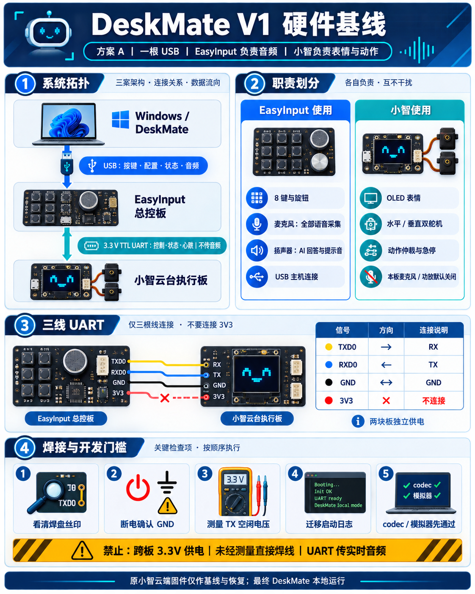

# DeskMate V1 hardware baseline

状态：`DECISION_CONFIRMED`，电气焊点与真机测量仍待验收  
冻结日期：2026-08-24  
适用范围：DeskMate Windows 软件、EasyInput V2.0 总控板、小智 ESP32-S3 云台板的第一版集成

> 本文冻结第一版“使用哪些硬件、哪些硬件暂不使用、两块板怎样通讯和供电”。它允许开始协议、固件骨架、模拟器和宿主测试开发，但不构成焊接、烧录、读取 Flash 或驱动舵机的授权。



## 1. 已确认的产品选择

第一版采用方案 A：电脑只把 EasyInput 当作日常主设备；EasyInput 与小智紧挨安装，小智开发板最终放在 EasyInput 下层。两块板在原型阶段独立供电。

| 项目 | V1 决定 |
| --- | --- |
| Windows 连接 | Windows 通过 USB 与 EasyInput 通讯 |
| 语音采集 | 使用 EasyInput 板载麦克风 |
| 语音播放 | 使用 EasyInput 板载扬声器 |
| 小智音频 | 麦克风、功放和扬声器保留在实物上，DeskMate 模式默认不初始化 |
| 小智职责 | OLED 表情、双舵机、状态和安全动作执行 |
| 板间链路 | 三线、全双工、3.3 V TTL UART，只传控制、状态和确认 |
| 板间音频 | UART 不传实时音频 |
| 原型供电 | 两块板分别使用各自已支持的供电路径，只共逻辑地 |
| 原小智云端 | 保留当前固件作为功能对照与恢复基线；最终 DeskMate 产品不依赖云端对话 |

## 2. V1 物理拓扑

```text
Windows / DeskMate
       │
       │ USB：按键、配置、状态、EasyInput 音频
       ▼
EasyInput V2.0 总控板
       │
       │ DeskMate Link v1：3.3 V TTL UART
       │ 控制、状态、心跳、ACK、错误；不传音频
       ▼
小智云台执行板
       ├── SSD1306 128×64 OLED
       ├── yaw 水平舵机
       └── pitch 垂直舵机
```

## 3. 硬件职责冻结

### 3.1 EasyInput 使用的硬件

- S1～S8 八个实体按键。
- 旋钮 A/B 相位与旋钮按压。
- 原生 USB、USB/BLE HID、配置与状态通道。
- 板载数字麦克风，作为文字输入和陪伴对话的统一采集入口。
- 板载功放/扬声器，作为 AI 回答、开始/结束和错误提示的统一播放入口。
- LED、状态灯、电池与电源管理。
- J4 的 `RXD0/TXD0/GND`，作为小智控制链候选。

EasyInput 的 LED、麦克风和扬声器共享 `GPIO8` 高有效电源域。固件必须通过统一电源租约/仲裁器管理，不能把 `GPIO8` 当成单独灯开关，也不能在其他消费者仍工作时关闭该电源域。

> 当前测试单元例外（2026-08-25）：用户确认这块实板的 S8 在本次烧录前即不亮且无输入响应；T03 真机测试复现同一现象。该事实只标记当前原型单元为 `CURRENT_UNIT_HARDWARE_BLOCK`，不改变产品的 S1～S8 设计、GPIO48 映射或健康实板验收要求。当前开发可继续使用 S1～S7，S8 需修板/换板复测或另行形成原型豁免决策。

#### 3.1.1 EasyInput Flash 布局

DeskMate 正式固件继承并冻结当前实板与 Maker 固定提交一致的 16 MB Flash 布局：

| 分区 | 起始 | 大小 | V1 规则 |
| --- | ---: | ---: | --- |
| `nvs` | `0x9000` | `0x6000` | 配置包实现前只保留，不读取、不覆盖 |
| `phy_init` | `0xF000` | `0x1000` | 保留 |
| `factory` | `0x10000` | `0x300000` | DeskMate EasyInput 应用 |
| `sound_a` | `0x310000` | `0x90000` | T03 不使用，保留给后续音频资源合同 |
| `sound_b` | `0x3A0000` | `0x90000` | T03 不使用，保留给后续音频资源合同 |

最小功能包也不得改用 ESP-IDF 默认 1 MiB factory 表。仓内 `partitions.csv`、CMake fail-closed 检查和 Host source-contract test 共同锁定该布局；首次写入前还必须把生成的分区表与授权备份中的实板分区表逐字节比较。

### 3.2 小智使用的硬件

- SSD1306 128×64 OLED：大眼睛、表情和工作状态。
- GPIO11 yaw 舵机与 GPIO12 pitch 舵机：经唯一动作仲裁器执行安全动作。
- 板载状态灯和必要按键，仅在合同明确后使用。
- 可焊接的 `GND/TX/RX` 候选焊盘：经照片、连通性和电平测量确认后用于 DeskMate Link。

### 3.3 小智暂不使用的硬件

- INMP441 麦克风。
- MAX98357A 功放和矩形扬声器。
- 原小智唤醒词、云端 STT/LLM/TTS、MCP 和云端音频链。

这些硬件不需要拆除或脱焊。DeskMate 正式固件默认不初始化它们，从而减少音频重复、回声、网络依赖、电源瞬态和调试变量。原云端固件作为独立恢复镜像保留，不与 DeskMate 本地会话长期混跑。

## 4. UART 接线合同

EasyInput J4 已有板级证据：

| J4 针位 | 信号 | MCU 侧 | V1 连接 |
| ---: | --- | --- | --- |
| 1 | `3V3` | 3.3 V 电源 | 留空并绝缘 |
| 2 | `RXD0` | GPIO44 / U0RXD | 接小智 TX |
| 3 | `TXD0` | GPIO43 / U0TXD | 接小智 RX |
| 4 | `GND` | 逻辑地 | 接小智 GND |

目标连线：

```text
EasyInput TXD0  ─────────→  小智 RX
EasyInput RXD0  ←─────────  小智 TX
EasyInput GND   ──────────  小智 GND
EasyInput 3V3   ── 不连接 ──  小智电源
```

第一版链路参数建议为 `115200 baud / 8N1 / 无硬件流控`。应用日志迁移到 USB Serial/JTAG，物理 TX/RX 只承载 DeskMate Link。接收器必须严格验证 framing、版本、长度、序列和 CRC，并丢弃 ROM 启动文本、乱码、截断帧、坏 CRC 和未知版本。

小智侧焊盘虽然可见，但在获得清晰近照、丝印方向、断电连通性和上电电平证据前，仍是“物理候选焊盘”，不能直接把照片中的位置写成最终焊点。

## 5. 供电合同

### 5.1 V1 原型

- EasyInput 使用自己的 USB/电池路径供电。
- 小智使用当前已经支持的电池、充电板或明确支持的 5 V 输入供电。
- 两板只连接 `TX/RX/GND`。
- 不连接 J4 `3V3`，不并联两块板的电池、5 V 或 3.3 V 电源。

### 5.2 后续单电源版本

单电源不是“从一块板焊一根电源线到另一块板”。后续必须独立设计电源树：

```text
统一 5 V 输入
  ├── EasyInput 逻辑与音频支路
  ├── 小智 ESP32/OLED 支路
  └── 双舵机高峰值支路
      └── 与两块 ESP32 共逻辑地
```

进入该阶段前必须确认总电流、舵机空载/堵转峰值、功放瞬态、稳压器余量、去耦、保险/保护和反灌路径。当前 `POWER_PATH_UNKNOWN` 尚未关闭，因此 V1 不实施跨板供电。

## 6. 焊接前验收门

只有以下条件全部通过，才允许申请串口焊接与首次真机联动：

1. 有小智 `GND/TX/RX` 焊盘和 EasyInput J4 的清晰近照，能够看清丝印和方向。
2. 两块板完全断电，万用表确认各自 GND、TX/RX 无短路。
3. 分别上电测得双方 TX 空闲电平约为 3.3 V，不存在 5 V UART。
4. 两板独立供电并共逻辑地，没有通过信号线或 J4 反向供电。
5. 两端应用日志已迁移到 USB Serial/JTAG。
6. 两端 codec、坏帧、截断、重复、超时和重启 host test 通过。
7. 焊线方案包含绝缘、应力固定和短线走向；不能让叠放结构拉扯焊盘。
8. 第一次联动只做 `get_capabilities/get_status` 和 OLED 显示，不播放声音、不驱动舵机。

## 7. 开发许可边界

本基线完成后，已经可以开始以下不接设备的开发：

- 正式固件模块骨架。
- DeskMate host contract 与 DeskMate Link v1。
- C/C++/JavaScript codec 和黄金测试向量。
- 模拟 EasyInput、模拟小智、假 UART sink。
- EasyInput 现有输入、配置、音频和电源逻辑的宿主测试与构建。
- 小智能力、状态、显示场景和动作仲裁器的宿主测试与构建。

以下工作仍未获授权：焊接、烧录、读取或备份 Flash/NVS、擦除、写 eFuse、跨板供电以及任何舵机动作。

## 8. 下一批需要补齐的实物证据

- 小智 `GND/TX/RX` 焊盘近照。
- EasyInput J4 近照。
- 两块板上下叠放的朝向、间距、绝缘和散热草图/照片。
- 小智当前供电方式及适配器规格。
- 原小智固件下 OLED、麦克风、扬声器、yaw、pitch 的逐项用户观察结果。
- 舵机方向、中心、安全机械范围和供电峰值的后续现场验收。

这些证据会把“已选方案”逐步升级为“真机已验证”，但不阻塞当前的代码、协议、模拟器和构建工作。
