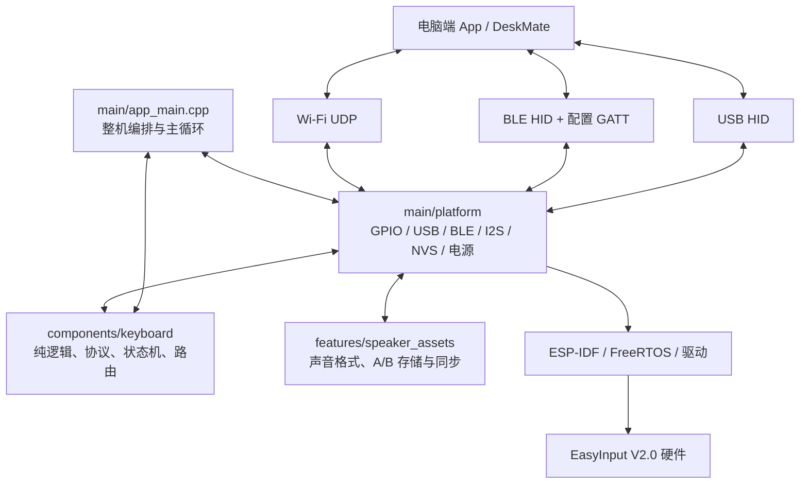

# EasyInput Maker 固件技术地图与 DeskMate 接入交接 · 2026-08-23

> 适用对象：接手 DeskMate 的 Agent，以及后续专门研究 EasyInput Maker 固件的会话。
>
> 使用原则：本文件告诉接手方“功能在哪里、接口如何流动、哪些设计可以借鉴、哪些硬件事实不能搬”。它不是让 DeskMate 复制固件源码，也不替代 Maker 仓库的 `AGENTS.md`、冻结协议和当前 Git 差异。

## 1. 一分钟定位

- Maker 固件项目根：`F:\Codex\easyinput-wzm\easy-input-maker`
- 正式 DeskMate 项目根：`F:\Codex\deskmate`
- 开发板：EasyInput V2.0；固件别名 `v2`；PCB 丝印 AI Keyboard V2.1，三者是同一硬件基线。
- SoC：ESP32-S3R8，8 MB Octal PSRAM，16 MB Flash。
- 构建框架：ESP-IDF 5.5.5、CMake/Ninja、C/C++、FreeRTOS。
- 主要平台组件：TinyUSB HID、NimBLE HID/GATT、Wi-Fi/LwIP UDP、NVS、GPIO、RMT、I2S、ADC、ESP Timer/PM。
- 当前公开 Git：`main` / `v0.4.53` / `7619bd13f9ddfd6e2d80e2b8e022ef0acf32ce01`。
- Host Action v1 生产实现已经在 `ff9f618` 提交；当前工作区另外保留未提交的 Windows 宿主测试兼容和 flow/教学记录。
- Maker 仓库只包含固件和协议参考，不包含电脑端 companion。

DeskMate 接手方应把 Maker 看作“独立设备与协议上游”，主要读取它的公开 wire 合同和行为，不把 `main/platform` 的 ESP-IDF 代码复制进 Electron/React。

## 2. 总体架构



最重要的分层规则：

- `components/keyboard` 尽量不依赖 ESP-IDF，负责可在 Windows/macOS/Linux 宿主测试的逻辑。
- `main/platform` 负责 ESP-IDF、GPIO、USB、BLE、Wi-Fi、I2S、NVS 等真实硬件适配。
- `main/app_main.cpp` 把输入、配置、事件、状态、传输、电源和音频串成整机运行流程。
- `host_test` 对纯逻辑和源码合同做电脑端验证。
- DeskMate 应在自己的 Electron/adapter 层实现协议对端，不应直接复刻 FreeRTOS 或 GPIO 代码。

## 3. 根目录每个文件夹负责什么

| 路径 | 内容 | 什么时候看 | 是否应复制到 DeskMate |
|---|---|---|---|
| `.claude/`、`.codex/`、`.hooks/` | Agent 收工检查和 Project Flow hook | 调整协作流程时 | 否，DeskMate 已有自己的流程 |
| `.github/` | Issue、PR、CI 等公开协作配置 | 准备贡献 Maker 上游时 | 否 |
| `assets/` | README 图片和公开说明素材 | 写 Maker 文档时 | 通常否 |
| `components/keyboard/` | 输入、配置、Keymap、状态、HID 纯协议、路由、电源/音频状态机 | 查业务逻辑和 wire 合同的第一入口 | 借鉴接口和测试，不复制整目录 |
| `components/esp_hid/` | 基于 ESP-IDF 的本地 HID 适配修改 | 查 BLE HID 底层兼容与上游差异 | 绝不搬进 DeskMate |
| `main/` | 固件入口、整机主循环与真实硬件适配 | 查事件如何真正到 USB/BLE/Wi-Fi/GPIO | 只读参考 |
| `features/speaker_assets/` | 声音文件格式、校验、A/B Flash 存储、同步、运行时 | 做声音资源同步或启动音时 | DeskMate 只实现协议对端 |
| `diagnostics/` | IMA-ADPCM、Ogg/Opus、扬声器专项诊断构建 | 专项音频诊断，不是默认生产入口 | 否 |
| `host_test/` | 纯逻辑、协议、状态、资源和源码合同测试 | 找某个功能的预期行为、失败边界 | 可以借鉴测试向量和断言思想 |
| `docs/` | 环境、硬件、安全、协议、发布和教学说明 | 动代码前先查证据与边界 | 可在 DeskMate 文档中做指针 |
| `flow/` | Maker 项目的目标、计划、冻结合同、进展和踩坑 | 接手 Maker 当前状态时 | 不复制；只引用真实文件 |
| `LICENSES/` | 第三方许可证正文 | 引入第三方代码/资源时 | 依据实际依赖处理 |
| `build/`、`build-*` | ESP-IDF 或宿主构建产物 | 只用于本机验证和取证 | 否；被 Git 忽略 |
| `managed_components/` | ESP-IDF 组件管理器下载的依赖 | 核对 `dependencies.lock` 时 | 否；不得当源码提交 |

## 4. 根目录关键文件

| 文件 | 作用 | 关键事实 |
|---|---|---|
| `CMakeLists.txt` | 固件构建总门 | 强制 `v2`、ESP32-S3、ESP-IDF 5.5.5、16 MB Flash、PSRAM/内存配置和固定分区 |
| `sdkconfig.defaults` | 受版本控制的默认配置 | 生成实际 `build/sdkconfig`；不能用源码根的旧 `sdkconfig` 代替 |
| `partitions.csv` | 固定 Flash 布局 | NVS、PHY、3 MiB factory app、两个 576 KiB 声音 bank |
| `dependencies.lock` | 默认构建依赖锁 | 用于核对 `managed_components`，必须保持可复现 |
| `main/idf_component.yml` | 主组件依赖 | 锁定 `idf == 5.5.5`，使用 `espressif/esp_tinyusb` |
| `AGENTS.md` | AI 开发边界 | 区分宿主测试、构建、烧录和真机证据；保护硬件与隐私 |
| `AI_DEVELOPMENT.md` | AI 查代码与验证入口 | 新任务先读，避免从生成目录开始 |
| `README.md` | 产品能力和文档索引 | 给人看的总体入口，不替代源码合同 |

## 5. `components/keyboard`：纯逻辑核心

### 5.1 配置解析与持久状态

关键文件：

- `include/keyboard/config_receiver.h` / `src/config_receiver.cpp`
  - Report ID `0x10` 的分块接收器；
  - 每块最多 52 字节，总 JSON 最多 2048 字节；
  - 顺序、总长度、CRC16 和 endpoint epoch 校验。
- `include/keyboard/config_payload.h` / `src/config_payload.cpp`
  - 把 JSON 解析为 `ParsedKeyboardConfig`；
  - 识别平台、PTT、Wi-Fi/音频、扬声器同步密钥、编码器和 Keymap；
  - 未知动作或非法字段 fail closed。
- `include/keyboard/config_state.h` / `src/config_state.cpp`
  - 保存当前已应用配置的纯逻辑视图；
  - 保留 `last_applied_json()` 供 NVS 原样持久化；
  - 不直接读写 Flash。
- `main/platform/nvs_store.*`
  - 真正把配置、平台、电池锚点和 GATT schema revision 写入 NVS。

真实配置链路：

```text
App 发送配置
  → USB/BLE Report 0x10，或受限 Wi-Fi JSON
  → ConfigReceiver 重组 + CRC16
  → app_main::apply_pending_config()
  → ConfigState::apply_json()
  → parse_config_payload()
  → NvsConfigStore::save_config_and_host_platform()
  → 只向原始 USB epoch / BLE owner 返回配置确认
```

配置确认走 Report ID `0x11`、kind `0x03`，带 phase、ok、saved、bytes 和 crc16。Wi-Fi 输入没有 HID owner，因此不能把确认泄漏给旁边的 USB/BLE 主机。

### 5.2 Keymap 与动作模型

关键文件：

- `include/keyboard/keymap.h`
- `src/keymap.cpp`
- `src/config_payload.cpp`

实体输入枚举：KEY1–KEY8、EncoderLeft、EncoderRight、EncoderPress。

主要动作包括：

- PTT / 编辑 PTT；
- 自定义 hotkey；
- fixed text；
- Host Action；
- copy、paste、select all、undo；
- paste last、history、settings、profile 切换；
- 编码器滚动/光标/选择。

`event_for_action()` 是“配置动作 → 固件事件”的核心函数。它接收 `Action`、Pressed/Released、平台和 PTT hotkey，返回 `FirmwareEvent`。业务层不要绕过它直接拼 USB/BLE 报告。

### 5.3 输入、消抖和编码器

纯逻辑入口：

- `debounce.*`：按键消抖；
- `encoder.*`：正交编码器相位；
- `encoder_press_gesture.*`：旋钮按压手势；
- `held_keyboard_state.*`：按住键盘状态；
- `keyboard_snapshot_delivery.*`：完整键盘快照可靠交付；
- `input_feedback.*`：输入到 LED 反馈语义；
- `input_test.*`、`diagnostic_command.*`：诊断和输入测试。

真实 GPIO 适配是 `main/platform/gpio_keys.*`；主循环在 `main/app_main.cpp` 取得边沿事件，再查询 Keymap 和调用 `event_for_action()`。

### 5.4 共享传输与路由

关键文件：

- `include/keyboard/transport_routing.h`
- `src/transport_routing.cpp`
- `hid_report_queue.*`
- `keyboard_snapshot_delivery.*`
- `usb_hid_endpoint_arbiter.h`
- BLE 的 `ble_input_scheduler.*`、`ble_owner_recovery.*`、`ble_connection_profile.*`

这里解决的不是“USB 和 BLE 都能发”这么简单，而是：

- 一个按住动作的 down/up 不能跨到两个电脑；
- USB endpoint 和 BLE owner 都按 epoch/generation 区分生命周期；
- USB 优先时，已选 USB 失败也不偷偷补发 BLE；
- 队列拥堵、断线、重连和 owner 变化不会制造重复按键；
- 双连接不能双发。

DeskMate 如果增加新的设备适配器，应借鉴“明确 owner + 生命周期 token + 入队即接管 + 不跨通道补发”的模式，而不是复制 ESP-IDF 队列代码。

### 5.5 状态、能力与 512 字节边界

关键文件：

- `config_status.*`：构造完整、紧凑、speaker probe、确认、battery、fallback 状态；
- `status_hid_protocol.*`：Report `0x13` 状态请求，Report `0x11` / kind `0x04` 分块响应；
- `ble_status_wire.h`：BLE 最终发布前附加 BLE 运行状态；
- `gatt_status_snapshot.h`：远端读取时的一致快照。

状态 JSON 的实际 BLE 发布上限是 512 UTF-8 字节。Host Action 能力以布尔值 `"host_action_v1": true` 位于 `capabilities` 内，不能放进 Host Action payload，也不能写成字符串。

### 5.6 Host Action v1

关键文件：

- `host_action_protocol.h/.cpp`：规范 UUID 验证和共享编码；
- `config_payload.cpp`：接受完整 `host_action:<uuid>`；
- `keymap.cpp`：按下生成一次 `FirmwareEventKind::HostAction`，松开生成 None；
- `transport_routing.cpp`：USB 优先，否则 BLE；
- `main/app_main.cpp::dispatch_firmware_event()`：整机路由；
- `main/platform/usb_hid.cpp` 与 `ble_hid.cpp`：进入各自既有 App Command 队列。

冻结字段：

```text
Report ID      0x11
kind           0x05
chunk index    0
total chunks   1
data length    36
data           无 host_action: 前缀的 canonical lowercase UUID ASCII
container      63 字节；剩余字节保持 0
```

完整 `host_action:` 配置值只在配置层和 Keymap 中保存；线上只发送 36 字节 UUID。大写、长度错误、连字符错误或非法字符必须拒绝，不自动修复；不额外增加 UUID version 或 nil UUID 限制。

## 6. `main`：ESP-IDF 整机与平台适配

### 6.1 `main/app_main.cpp`

这是固件的整机编排入口，不适合直接复制到 DeskMate。查真实链路时重点搜索：

- `app_main()`：系统启动和主循环；
- `load_stored_config()`：从 NVS 加载配置；
- `apply_pending_config()`：统一消费 USB、BLE、Wi-Fi 配置；
- `handle_input_event()` 附近：输入事件 → Keymap → FirmwareEvent；
- `dispatch_firmware_event()`：FirmwareEvent → 单通道路由；
- `publish_config_status_*()`：状态 JSON 生成与发布；
- `send_hid_config_ack()`：把确认发回原始 endpoint owner；
- `sync_keyboard_audio_config()`：把配置同步到音频链路。

### 6.2 `main/platform` 文件速查

| 文件 | 负责什么 | DeskMate 最需要读什么 |
|---|---|---|
| `gpio_keys.*` | KEY1–KEY8、编码器和唤醒 GPIO | 输入边沿从哪里进入主循环 |
| `usb_hid.*` | TinyUSB 描述符、HID 报告、配置、App Command、状态、声音资源 | Report ID、方向、长度、队列和 endpoint epoch |
| `ble_hid.*` | NimBLE HID、配置 GATT、状态读取、绑定持久化、广告和队列 | 与 USB 共用的协议边界、BLE owner/generation、512 字节状态 |
| `keyboard_audio.*` | Wi-Fi、控制心跳、I2S 麦克风、PCM UDP、配置 JSON入口 | DeskMate 的音频 companion 对端合同 |
| `nvs_store.*` | 配置与少量运行状态持久化 | 哪些字段属于设备持久状态 |
| `peripheral_power.*` | GPIO8 共享电源唯一拥有者 | 为什么 LED/MIC/SPK 不能各自开关电源 |
| `led_strip_status.*` | WS2812、输入/连接/Agent 状态反馈 | Agent 状态如何映射为视觉反馈 |
| `battery_adc.*` | ADC 电池采样 | 原始电压如何进入估算逻辑 |
| `speaker_output.*` | I2S 扬声器输出 | 播放硬件边界 |
| `speaker_assets_supervisor.*` | 声音资源服务编排 | A/B bank 和播放生命周期 |
| `speaker_assets_wifi.*` | 声音资源网络同步 | DeskMate 如果实现同步客户端应对照的 wire |

## 7. 固件对电脑公开的主要接口

### 7.1 HID 报告与 App Command

| Report / kind | 方向 | 用途 | 主要实现 |
|---|---|---|---|
| Report `0x01` | 固件 → 电脑 | 标准键盘报告 | `usb_hid.cpp`、`ble_hid.cpp` |
| Report `0x02` | 固件 → 电脑 | 鼠标/滚轮 | 同上 |
| Report `0x10` | 电脑 → 固件 | 分块配置 JSON，带长度/CRC | `config_receiver.*` + USB/BLE 适配 |
| Report `0x11`, kind `0x01` | 固件 → App | 固定文字分块 | `fixed_text_protocol.h`、BLE fixed text stream、USB/BLE |
| Report `0x11`, kind `0x02` | 固件 → App | App 侧 hotkey down/up | USB/BLE App Command |
| Report `0x11`, kind `0x03` | 固件 → App | 配置保存确认 | `send_config_ack*()` |
| Report `0x11`, kind `0x04` | 固件 → App | 状态 JSON 分块响应 | `status_hid_protocol.*` |
| Report `0x11`, kind `0x05` | 固件 → App | Host Action v1 UUID | `host_action_protocol.*` |
| Report `0x12` | 电脑 → 固件 | Agent 状态命令，16 字节 | `agent_status.h` + USB/BLE |
| Report `0x13` | 电脑 → 固件 | 状态读取请求，16 字节 | `status_hid_protocol.*` |
| Report `0x14/0x15` | USB 双向 | 声音资源请求/响应 | `usb_hid.cpp` + speaker assets |

USB 和 BLE 共享协议语义，但物理接入和生命周期不同。新增消息时必须先在 `components/keyboard` 建立唯一共享编码/解码和宿主测试，再让 USB/BLE 适配调用；不能在两个平台文件中复制常量和编码器。

### 7.2 Wi-Fi 麦克风控制与音频

| 魔数 | 方向 | 用途 |
|---|---|---|
| `EIHB` | 固件 → companion | 心跳，v1 基础 20 字节，可有已接线扩展 |
| `EICC` | companion → 固件 | start / stop / keepalive，至少 36 字节 |
| `EICA` | 固件 → companion | 控制确认，20 字节 |
| `EIAU` | 固件 → companion | v2 音频包；32 字节头 + PCM S16LE mono payload |

主要文件：

- `audio_control_wire.*`：EIHB/EICC/EICA；
- `audio_packet_wire.h`：EIAU 头；
- `audio_session.*`：会话生命周期；
- `main/platform/keyboard_audio.*`：Wi-Fi、来源 IP 限制、I2S 采集和数据发送；
- `docs/security/audio-control-v1.md`：安全边界。

当前 EICC token 只是兼容预留，不做密码学验证；来源 IP 也不是强身份。DeskMate 只能在受信任本地网络实现该 companion，不能把 UDP 端口暴露到公网，也不能把这套音频 wire 用作未授权的通用设备控制通道。

### 7.3 设备身份

当前产品身份由生产项目定义，不是板级 GPIO事实：

- USB VID/PID：`0x303A / 0x1006`；
- USB 产品字符串：`EasyInput AI` / `EasyInput AI HID`；
- BLE 名称：`EasyInput AI`；
- BLE manufacturer：`AIOTWAN`；
- 固件板型序列字符串入口：`board_pins.h`。

DeskMate 可以用经过批准的 VID/PID 和协议识别兼容设备，但不得把设备序列号、MAC 或完整设备路径写入日志或项目记录。迁移功能时也不得顺手修改这些身份或 HID/GATT 描述符。

## 8. 真实硬件地图与保护边界

### 8.1 引脚

| 功能 | GPIO / 语义 |
|---|---|
| KEY1–KEY8 | `2, 47, 38, 41, 1, 6, 7, 48`，低有效独立输入 |
| 编码器 A/B/按压 | `17/16/18`；A/B 是正交相位 |
| KEY_WAKE | GPIO21，低有效汇总；唤醒后仍需重扫 |
| WS2812 | GPIO12，5 颗串联 GRB |
| 独立状态灯 | GPIO42 |
| GPIO8 | 高有效 LED/MIC/SPK 共享电源域 |
| 麦克风 I2S | BCLK/WS/DIN = `9/10/11` |
| 扬声器 I2S | BCLK/WS/DOUT = `14/13/15` |
| 电池采样 | enable GPIO5、ADC GPIO4 |
| 外部供电/充电 | GPIO40 低=外部供电；仅在其有效时解释 GPIO39：高=充电、低=充满 |
| 原生 USB | D−/D+ = `19/20` |
| BOOT | GPIO0，专用下载入口，不是业务键 |
| J4 UART0 | 3V3、RXD0、TXD0、GND；MCU GPIO44/43，3.3 V TTL |

### 8.2 GPIO8 共享电源

GPIO8 不是 LED 开关。它同时控制 WS2812、麦克风和扬声器电源域。任何代码都必须通过 `PeripheralPowerController`/租约协调消费者。关断前必须停止外设并恢复安全引脚；GPIO11 是输入，掉电时保持 disabled/floating。

### 8.3 BOOT 唯一正确规则

- 进入下载模式：开发板保持开机，短按并松开一次 BOOT。
- 恢复正常启动：用板上电源开关关机，再正常开机。
- 不按住 BOOT 上电，不要求不存在的 RESET。

### 8.4 与小智直连的当前结论

Maker 虽然公开了 J4 UART0，但这不等于已经批准用它连接小智。UART0 可能包含启动日志；小智侧可用引脚、方向、电压、占用和启动行为尚未核对。DeskMate Link v1 的物理层未冻结前，不接线、不猜包格式、不把 J4 当成默认总线。

## 9. 声音资源与 `features/speaker_assets`

这一层不是普通的“播放一个音频文件”，而是完整的资源产品链：

- `sound_asset_format.*`、`sound_asset_reader.*`：资源格式和读取；
- `sound_asset_crypto.*`：同步相关校验/加密工具；
- `sound_asset_store.*`、`esp_sound_bank_storage.*`：A/B bank；
- `speaker_assets_protocol.*`：USB 同步协议；
- `speaker_assets_wifi_wire.*`：Wi-Fi 同步 wire；
- `speaker_assets_session.*`、`runtime.*`、`store_executor.*`：会话与执行；
- `factory_boot_sound.*`：出厂启动音和回退。

分区固定：

```text
nvs       0x9000    0x6000
phy_init  0xF000    0x1000
factory   0x10000   0x300000
sound_a   0x310000  0x90000
sound_b   0x3A0000  0x90000
```

DeskMate 若需要管理声音资源，应实现协议客户端和用户可见进度，不应复制 Flash bank 执行器；也不能改变分区来“简化”软件端工作。

## 10. 测试体系：找功能预期的最快办法

`host_test` 当前有 60 个 CTest 目标的历史验收记录。查一个功能时，先找同名 `*_tests.cpp`：

- 配置/Keymap：`config_payload_tests`、`config_receiver_tests`、`config_state_tests`、`keymap_tests`；
- Host Action：`host_action_protocol_tests`、`host_action_key_bindings_tests`、`host_action_capability_status_tests`；
- USB/BLE 路由：`transport_routing_tests`、`usb_hid_endpoint_arbiter_tests`、`ble_*_tests`；
- 状态：`config_status_tests`、`status_hid_protocol_tests`、`gatt_status_snapshot_tests`、`ble_status_wire_tests`；
- 输入：`debounce_tests`、`encoder_tests`、`held_keyboard_state_tests`、`keyboard_snapshot_delivery_tests`；
- 音频：`audio_control_wire_tests`、`audio_packet_wire_tests`、`audio_session_tests`、`audio_io_arbiter_tests`；
- 电源/电池：`peripheral_power_lease_tests`、`power_policy_tests`、`power_cycle_tests`、`battery_estimator_tests`；
- 声音资源：`sound_asset_*`、`speaker_assets_*`、`speaker_playback_tests`；
- 禁止范围：`board_pins_tests`、`firmware_source_contract_tests`。

默认验证：

```powershell
cmake -S host_test -B build-host -DCMAKE_BUILD_TYPE=Debug
cmake --build build-host
ctest --test-dir build-host --output-on-failure

# 在已激活的项目锁定 ESP-IDF 5.5.5 环境中
idf.py build
```

测试通过只证明纯逻辑；ESP-IDF build 只证明能生成固件；flash 只证明已写入；正常启动和真实功能必须另行观察。

## 11. 按需求找入口

| 想做什么 | 第一批读取 | 随后读取 | 对应测试 |
|---|---|---|---|
| 新增/修改按键动作 | `keymap.h/.cpp`、`config_payload.cpp` | `app_main.cpp` 事件分发 | `keymap_tests`、`config_payload_tests` |
| 接收 App 配置 | `config_receiver.*`、`config_state.*` | USB/BLE 接收、`apply_pending_config()`、NVS | `config_receiver_tests`、`config_state_tests` |
| 新增电脑端消息 | 先建共享协议 header/source | `transport_routing`、USB/BLE 两个适配 | 新协议测试 + 路由测试 + 源码合同测试 |
| 修改 USB 行为 | `usb_hid.*` | endpoint arbiter、HID 队列 | `usb_hid_endpoint_arbiter_tests`、源码合同 |
| 修改 BLE 行为 | `ble_hid.*` | scheduler、owner recovery、persistence、status wire | 对应 `ble_*_tests` |
| 实现 Host Action 对端 | `host_action_protocol.*` | `keymap.cpp`、`app_main.cpp`、USB/BLE | 三个 Host Action 测试 |
| 接板载麦克风 | `audio_control_wire.*`、`audio_packet_wire.h`、`audio_session.*` | `keyboard_audio.*`、安全文档 | audio 系列测试 |
| 接收 Agent 状态 | `agent_status.h` | USB/BLE 0x12、LED status | `agent_status_tests` |
| 读取设备状态 | `config_status.*`、`status_hid_protocol.*` | BLE GATT status、USB 0x13/0x11 | 状态系列测试 |
| 改灯光 | `input_feedback.*`、`agent_status.h` | `led_strip_status.*`、GPIO8 电源 | LED/反馈和电源测试 |
| 改睡眠/电源 | `power_policy.*`、`awake_wait_planner.*` | `peripheral_power.*`、audio/USB/BLE quiesce | power 系列测试 |
| 管理声音资源 | `features/speaker_assets` 协议与 runtime | platform speaker supervisor/output/wifi | sound/speaker 系列测试 |

## 12. DeskMate 可以借鉴什么，不能搬什么

### 可以借鉴

- 先在纯逻辑层定义协议和 fail-closed 解析器；
- USB/BLE 复用一个编码边界；
- endpoint epoch / owner generation 防止跨连接重放；
- 单通道选择，失败不跨通道补发；
- 配置保存后回传 bytes + CRC16 + saved，而不是只提示“已发送”；
- 状态、确认、业务动作使用不同 kind；
- 每项协议同时有正常、非法、边界、断线和重复测试；
- 用 adapter 隔离设备实现，UI 不直接访问原始 HID/Node 设备路径。

### 不能直接搬

- ESP-IDF GPIO、FreeRTOS task/queue、TinyUSB/NimBLE 回调；
- Maker 的 GPIO、GPIO8 电源时序和 BOOT 规则；
- USB/BLE 描述符、VID/PID、名称、BLE UUID 或地址策略；
- Maker NVS key、Flash 分区和声音 bank 地址；
- Host Action `0x05` 作为别的协议；
- 测试 UUID、Wi-Fi 测试值或本机设备路径；
- 任何构建目录、`sdkconfig`、`managed_components` 或二进制。

## 13. DeskMate 近期应如何使用这份地图

1. 先在 DeskMate 完成迁移后 60/60 与桌面构建复验。
2. 对照 Maker `docs/security/audio-control-v1.md` 和 wire headers，实现 EIHB/EICC/EICA/EIAU 的 companion 侧 codec、会话和 mock board。
3. 对照 HID `0x10/0x11/0x12/0x13` 实现纯编解码测试，不连接真实 HID、不猜路径。
4. 用 Electron 主进程/adapter 承担设备访问，React 只接收脱敏、高层状态。
5. 电脑麦克风保持默认和回退，板载麦克风由用户主动选择。
6. Host Action “打开应用”作为单独兼容功能核对；不要把它和小智表情/舵机协议混合。
7. 小智会话产出的技术地图完成后，再共同冻结 DeskMate Link v1 和第一条 `KEY1 → DeskMate → happy_nod` 纵向链路。

## 14. 当前证据与未验证项

### 已有历史证据

- Host CTest：发现/执行/通过 60/60，失败 0；
- ESP-IDF：5.5.5、`v2/esp32s3` 默认构建通过；
- 应用镜像：1,640,528 字节；
- 已经用户确认烧录；正常模式观察到 `VID_303A/PID_1006` HID；
- Host Action 纯逻辑、八键、共享编码、路由和能力测试已进入当前公开提交/测试体系。

### 当前仍未验证

- EasyInput App 0.1.26 中真实 Host Action “打开应用”入口、同步确认和七项真机矩阵；
- DeskMate 是否已经实现 Host Action v1 对端；
- DeskMate 迁移包在新目录的用户人工复验；
- DeskMate 与小智的通信介质与 DeskMate Link v1；
- 任何 Maker→小智直接通信。

### 当前 Git 注意事项

Maker 当前工作区并不干净：有 flow/教学记录、`docs/learning` 和五个 Windows 宿主测试兼容文件的未提交差异。生产实现位于已提交的 `components/` 与 `main/`，当前工作区核对未见这两个生产目录的本地差异。接手方不得自动 reset、checkout、clean 或覆盖这些用户工作。

## 15. 给新 Agent 的 Maker 查阅提示词

```text
请把 F:\Codex\easyinput-wzm\easy-input-maker 作为独立、只读的 Maker 固件上游，把 F:\Codex\deskmate 作为 DeskMate 产品仓库。先读 Maker 的 AGENTS.md、AI_DEVELOPMENT.md、flow/进展.md 顶部、Host Action 冻结合同，以及 DeskMate 的 docs/handoffs/easyinput-maker-technical-map-2026-08-23.md。需要协议和业务行为时优先查 components/keyboard 与同名 host_test；需要 GPIO/USB/BLE/I2S/NVS 的真实接线时再查 main/platform；需要声音资源时查 features/speaker_assets。不要复制整个固件目录到 DeskMate，不要复用 Host Action 0x05 做小智协议，不要修改设备身份、HID/GATT、GPIO、BOOT、GPIO8、分区或依赖版本。本轮如无明确授权，只做只读核对和 DeskMate 侧纯协议/模拟器工作，不访问设备、不烧录。
```
